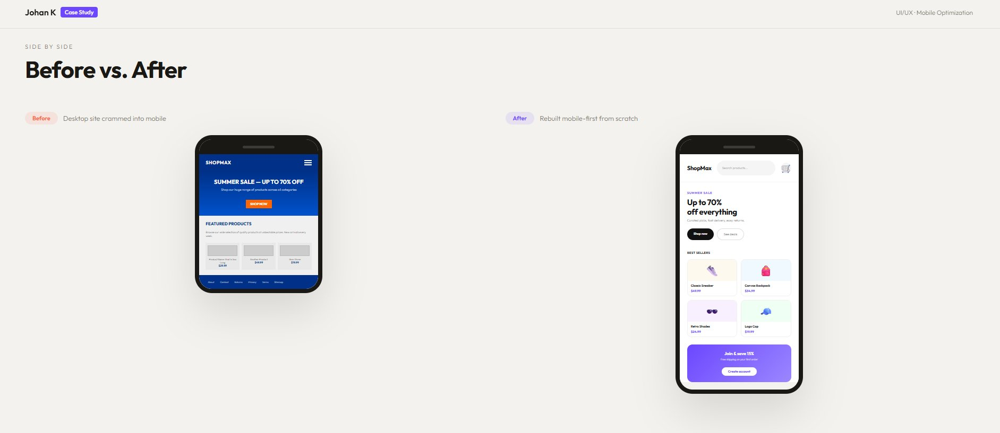
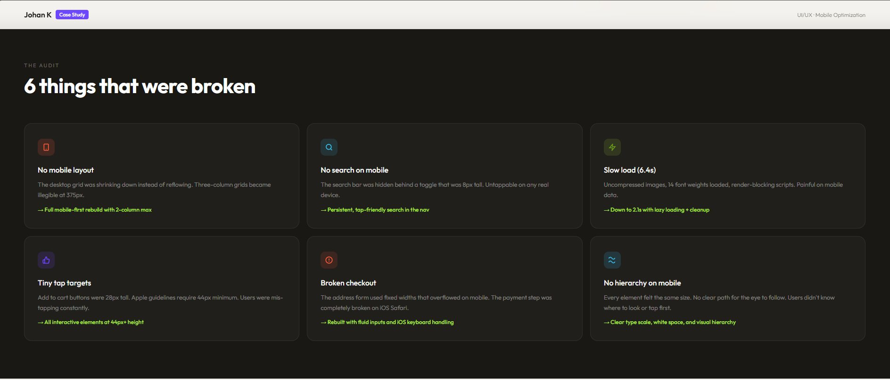

# Mobile UI Optimization — Case Study

A full UX audit and mobile-first redesign for an e-commerce store that was losing customers on mobile. Documents the exact problems found, the fixes applied, and the measurable results after launch.



---

## Live Demo

🔗 [johank-portfolio-mobile-ui.netlify.app](https://johank-portfolio-mobile-ui.netlify.app/)

---

## About

The client's site was built for desktop and never adapted for mobile. Over 60% of their traffic came from phones — but mobile conversions were near zero. This case study walks through the 6 critical issues found in the audit, the redesign decisions made, and the outcome 30 days after launch.

---

## Screenshots



---

## Results

| Metric | Change |
|---|---|
| Mobile conversion rate | +68% |
| Bounce rate | -54% |
| Page load time | -52% (6.4s → 2.1s) |
| Cart completion | +35% |
| Session duration | +41% |

---

## What Was Fixed

- No mobile layout — desktop grid crammed into small screens
- No accessible search on mobile
- Slow load time from uncompressed images and render-blocking scripts
- Tap targets too small (28px instead of 44px minimum)
- Checkout form broken on iOS Safari
- No visual hierarchy — users didn't know where to look

---

## Tech Stack

| Technology | Purpose |
|---|---|
| HTML5 | Structure and content |
| CSS3 | Mobile-first responsive layout |
| JavaScript | Scroll reveal animations |
| Google Fonts | Outfit typeface |

---

## Getting Started

```bash
git clone https://github.com/johank/ui-mobile-optimization.git
open index.html
```

---

## Contact

Built by **Johan K**
📧 [johank.dev1@gmail.com](mailto:johank.dev1@gmail.com)
🌐 [johank.netlify.app](https://johank.netlify.app)
